## DOKUMENTASI UAS MMUHAMMAD INGGAR A S (2388010052) - INFORMATIKA 6B

membuat instance baru 

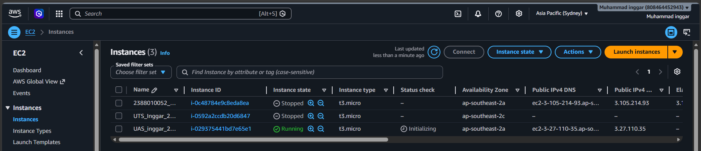
1. Proses Upload File Folder komdis-app
   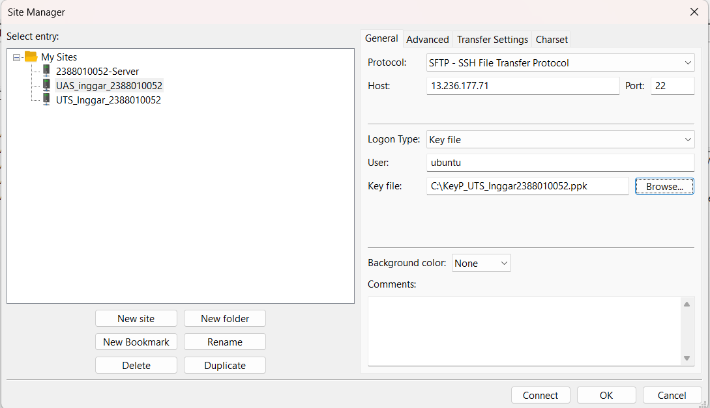
   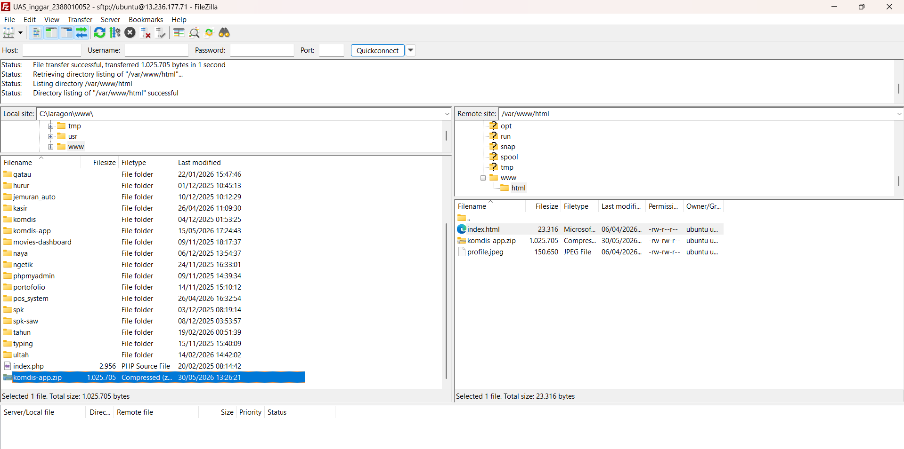
   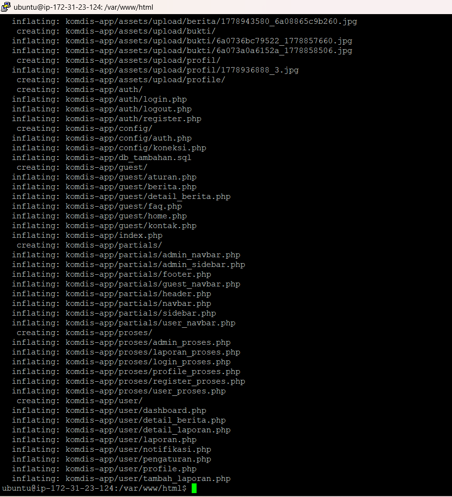
   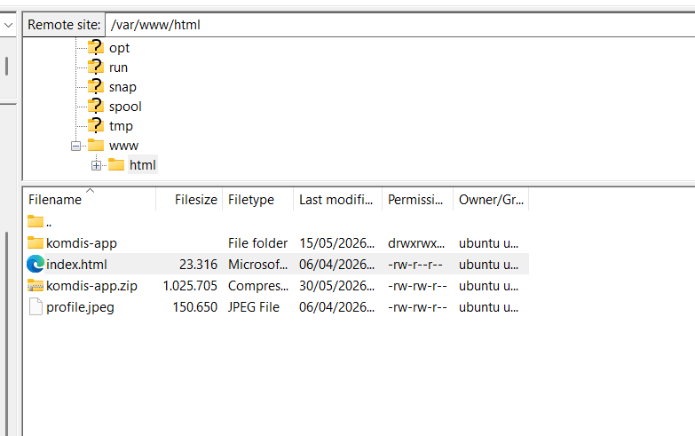

2. Mebuat database di mariadb
   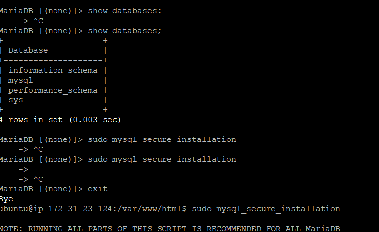
   - create database dbkomdis; 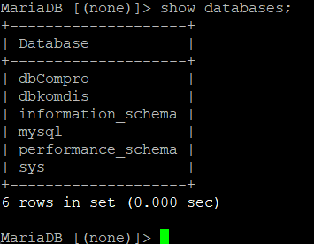
   - CREATE USER 'userkomdis'@'localhost' IDENTIFIED BY 'passwordkomdis';
   - grant all privileges on dbkommdis.* to 'userkomdis'@'localhost';
   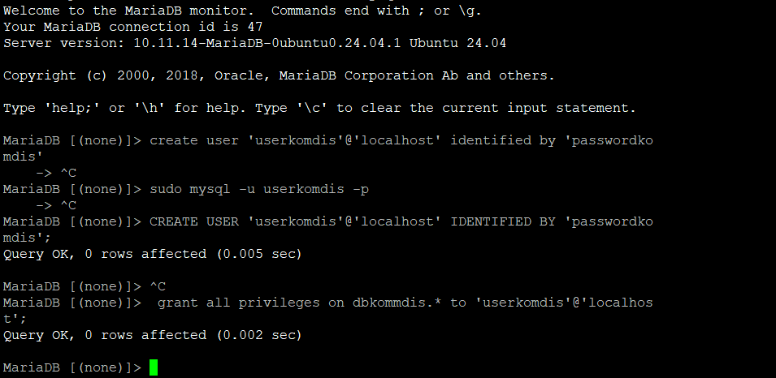
   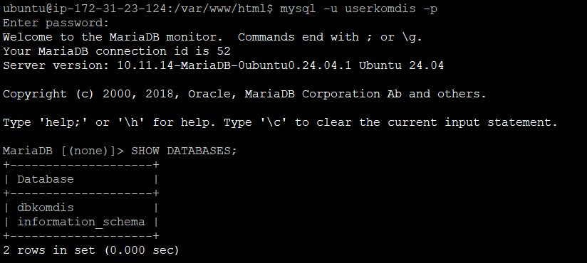

3. Export dbcompro dari localhost dari database phpmyadmin dalam bentuk sql
   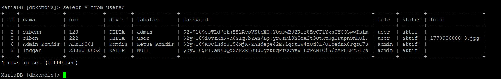

=======================================================================================================

4. instaall docker di ssh
   - 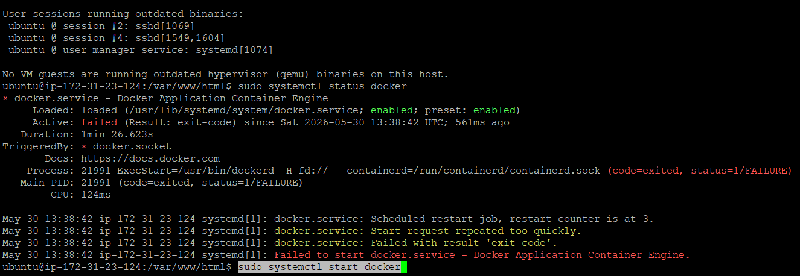

5. buka https//docker.com
   - buat repositori baru 
   - Create Token Access  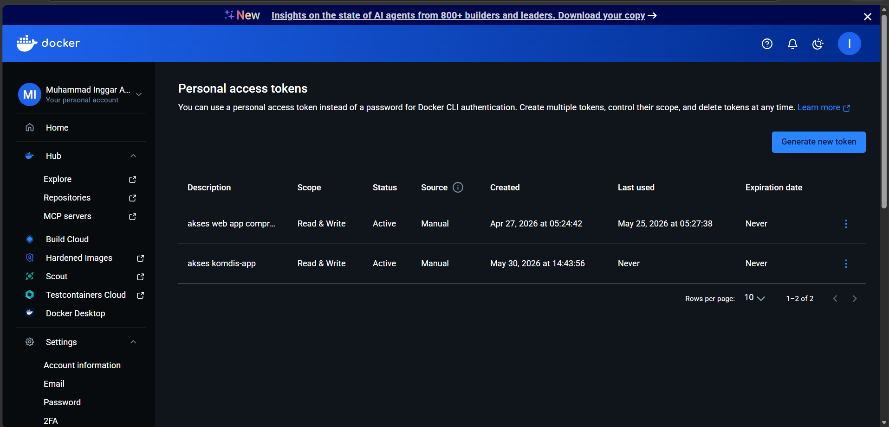
   - Buat repositori github 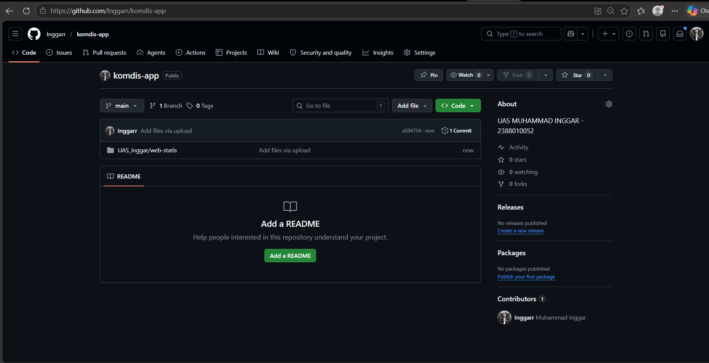

=======================================================================================================

6. Moderenisasi CI/CD
   - Mengisi Secrets Variable di Github Actions 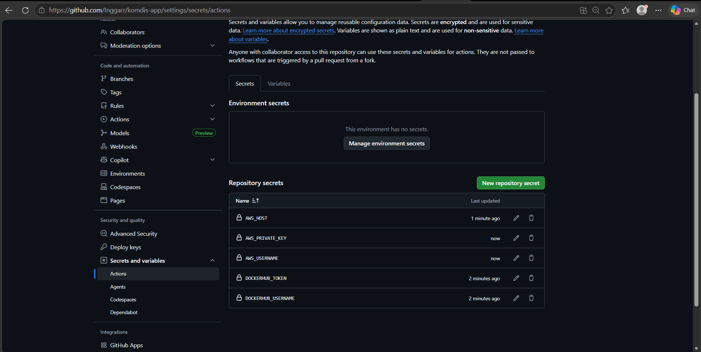
   - build and deploy 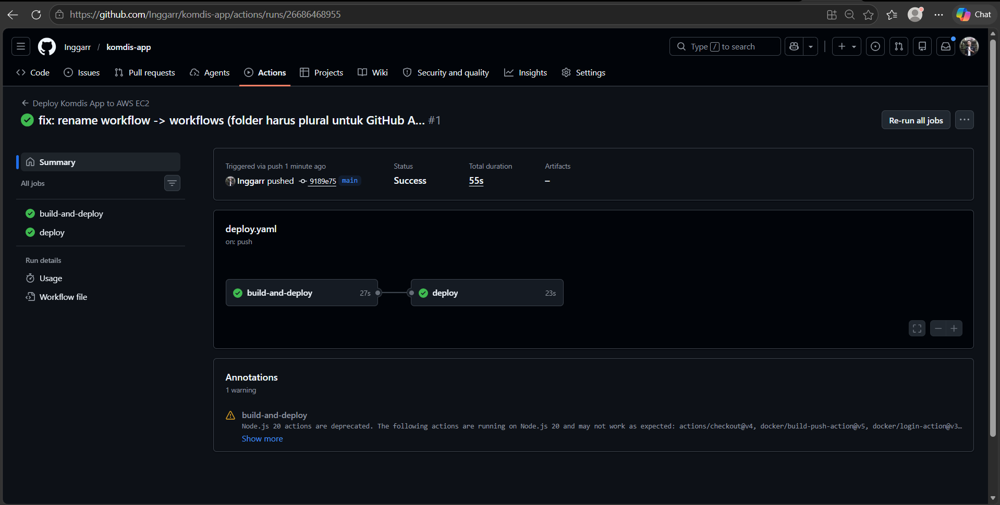 
   - cek web 

=======================================================================================================

7. Deploy Multi Apps CI/CD Docker
   - uninstall apache dan mariadb
   
   - Create user baru bukan root di BMS (Laragon) 
   - edit privilages 
   
8. Docker compose
   - repo docker baru 
   - bikin repo github baru
   - deploy 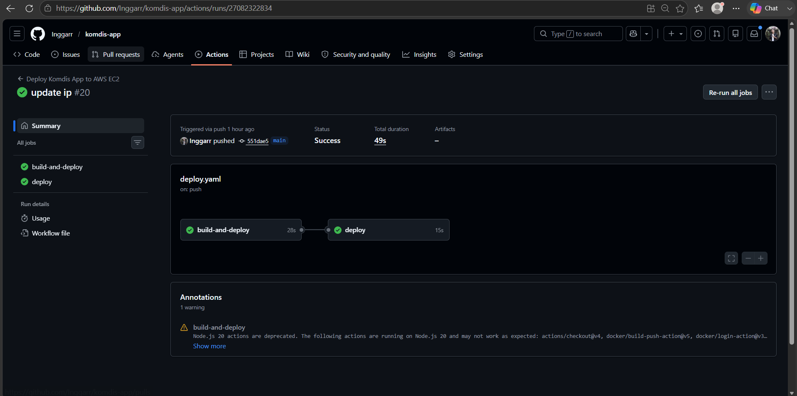

struktur folder
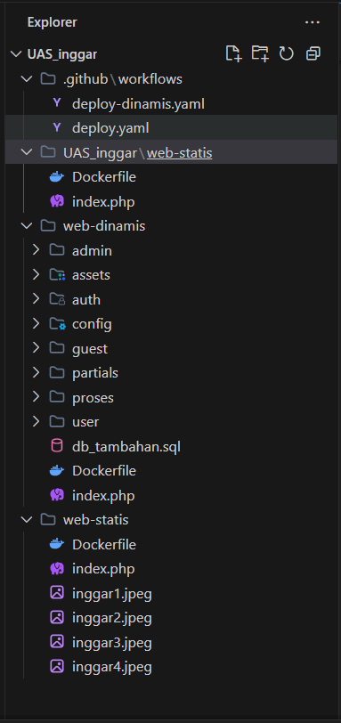