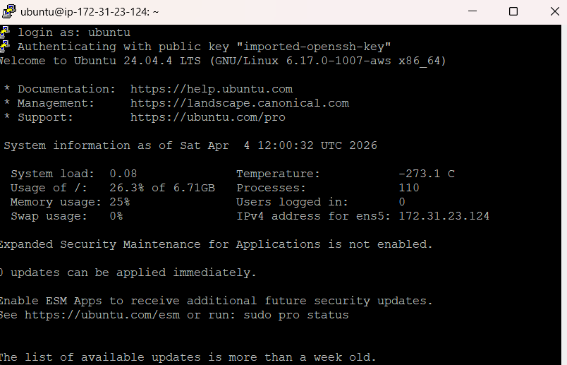
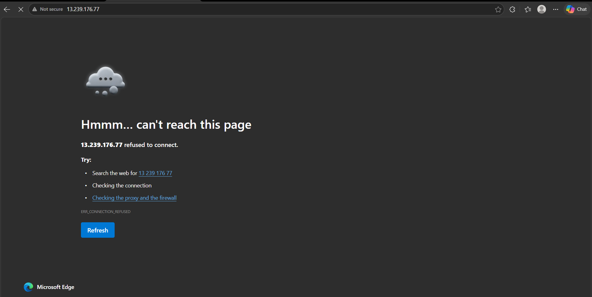
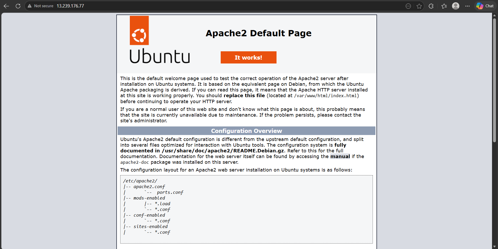
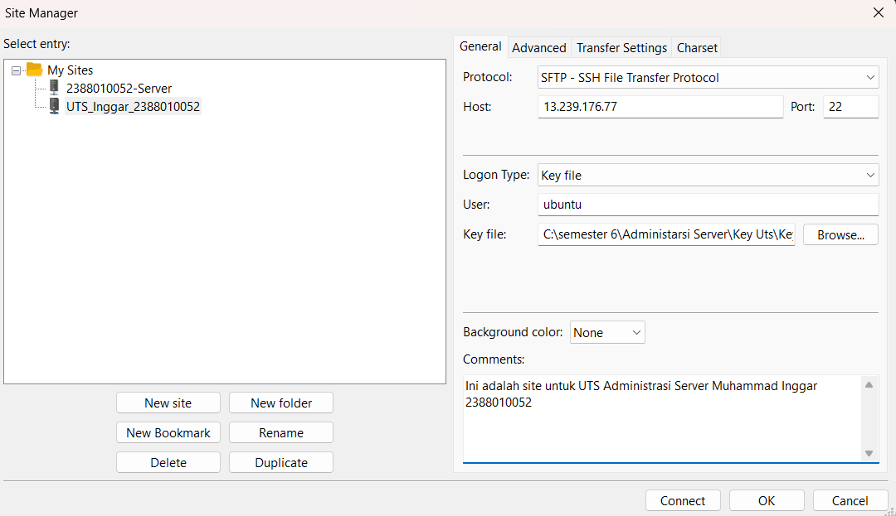
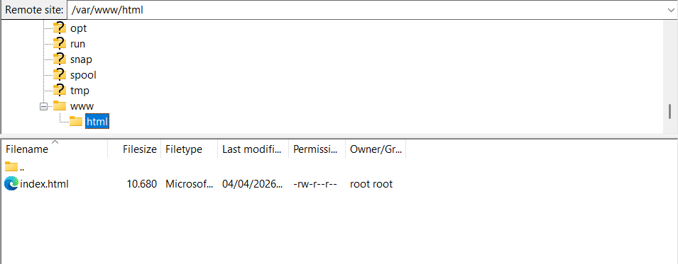
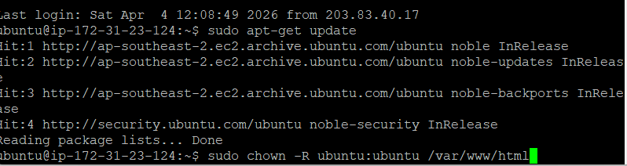
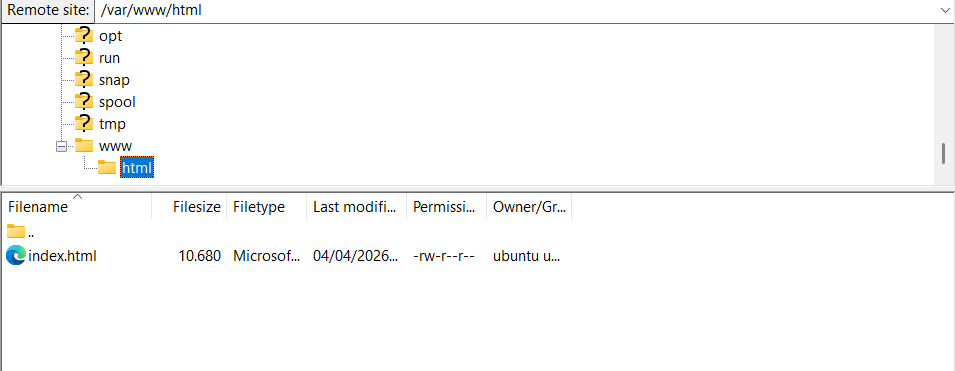
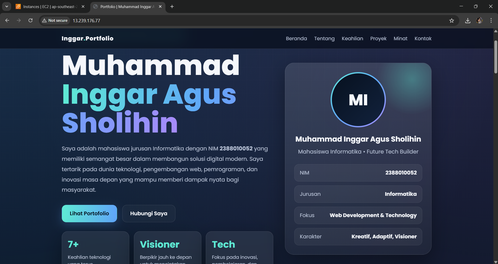

## Remote SSH Menggunakan Puty

1. Konversi file Public Key dari .pem menjadi .ppk di putty 
2. Simpan hasil Konversi 
3. Setup Putty
   - Load Key 
   - Isi Sessions 
4. Login Di putty 
5. sudo apt-get update
6. coba cek ip 
7. Install Install Web Server seperti Apache/Nginx (sudo apt install apache2) dan reload 
8. Bikin Site baru di fillezilla 
9. cek masih root dan ubah jadi ubuntu-ubuntu 
10. Sintaks: sudo chown -R ubuntu:ubuntu /var/www/html 
11. Cek kembali di file ze dan berhasil 
12. Ubah Index.html menjadi website portofolio 
