1. buka laman resmi AWS https://aws.amazon.com/
   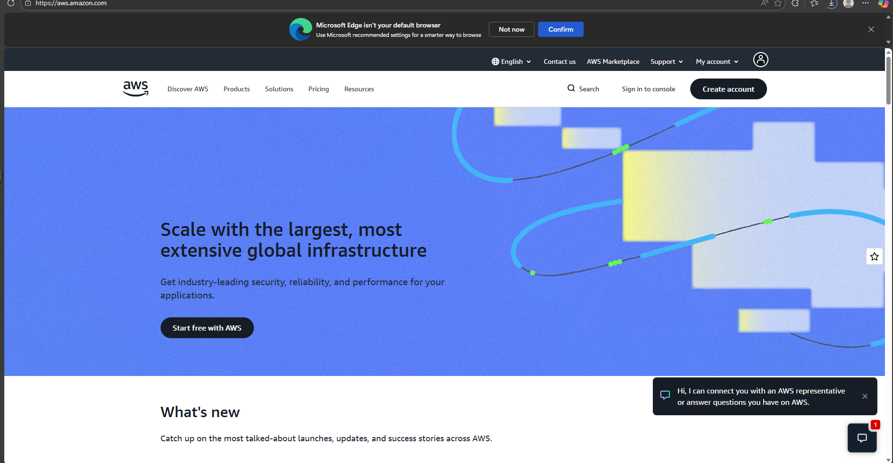

2. Pihih menu create account
   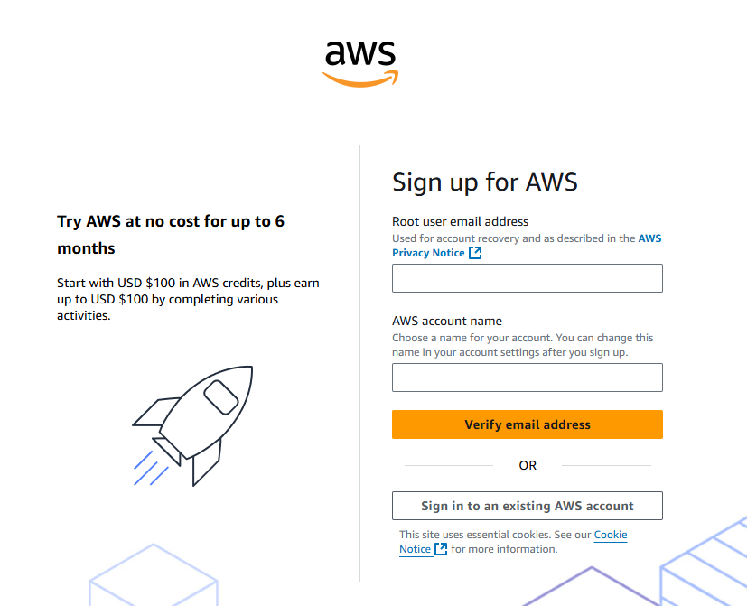

3. Isi email dan username
   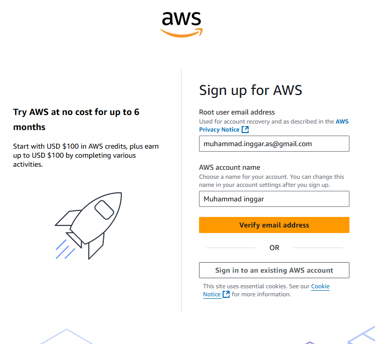

4.  Verifikasi email
    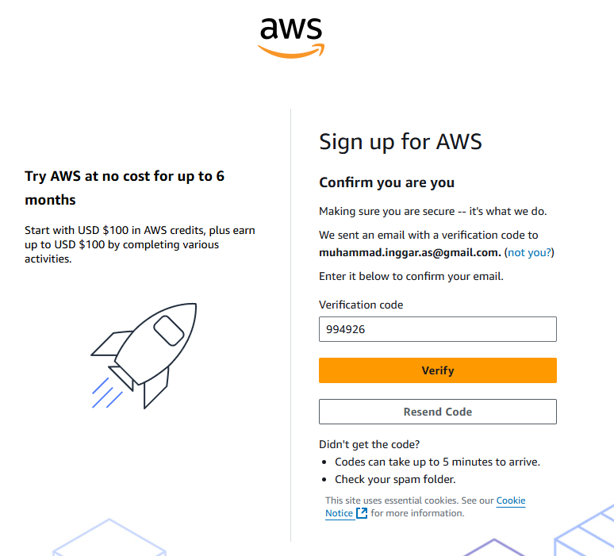

5. Membuat kata sandi
   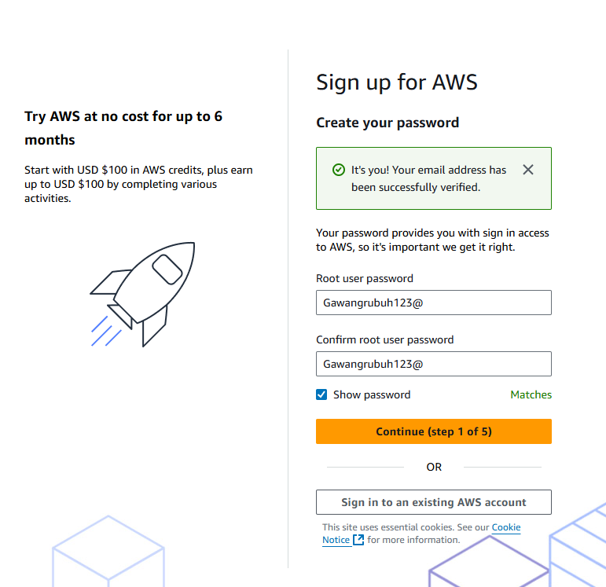

6. Pilih Free Tier
   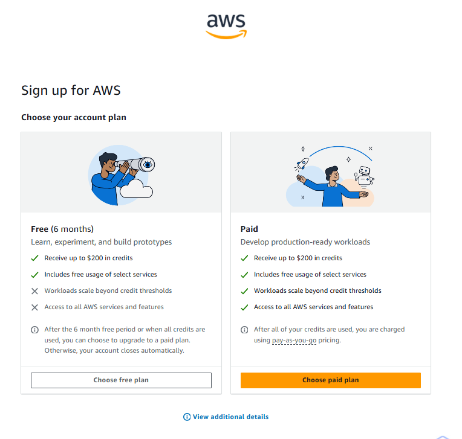

7. Mengisi personal information
   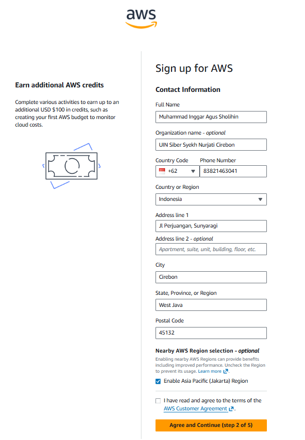

8. pembayaran kredit
   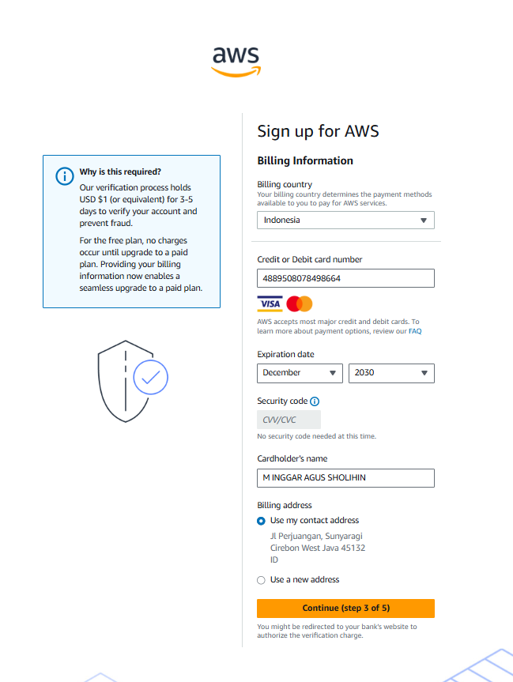

9. Sign Up AWS
   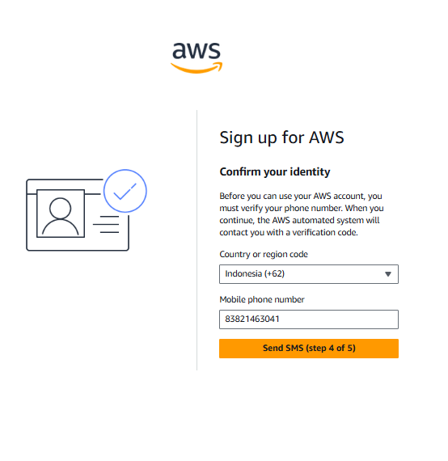

10. Sudah masuk ke tampilan awal
   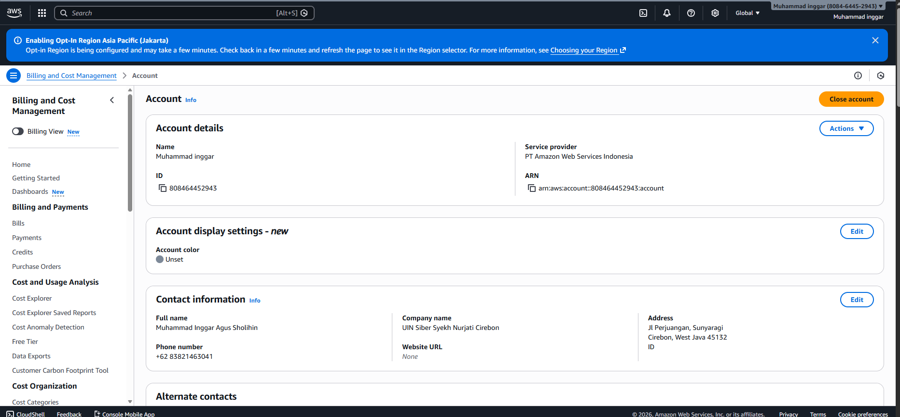

11. Console Home
    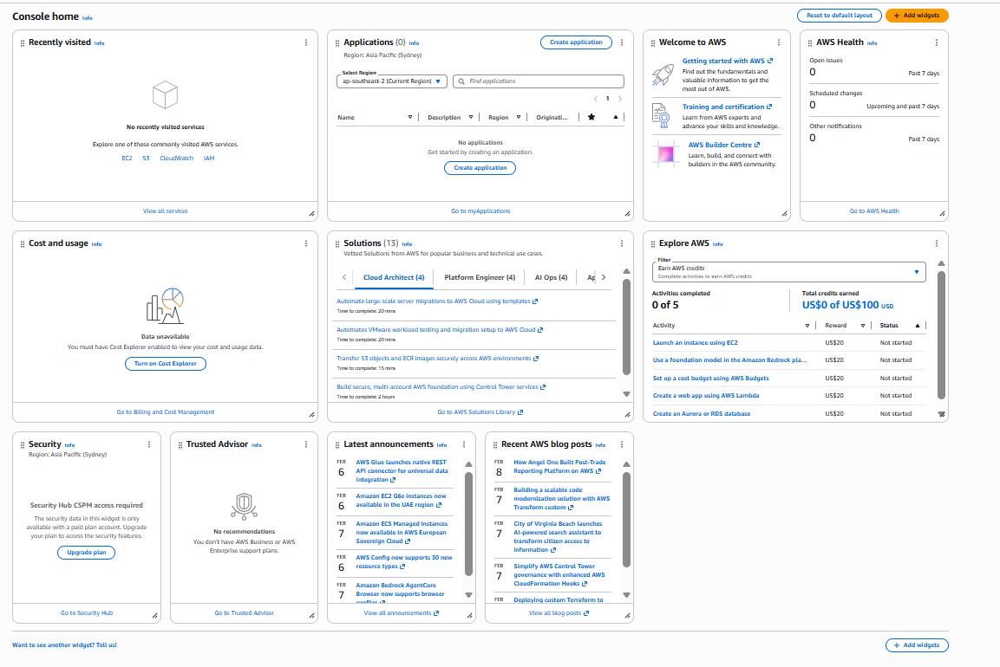
    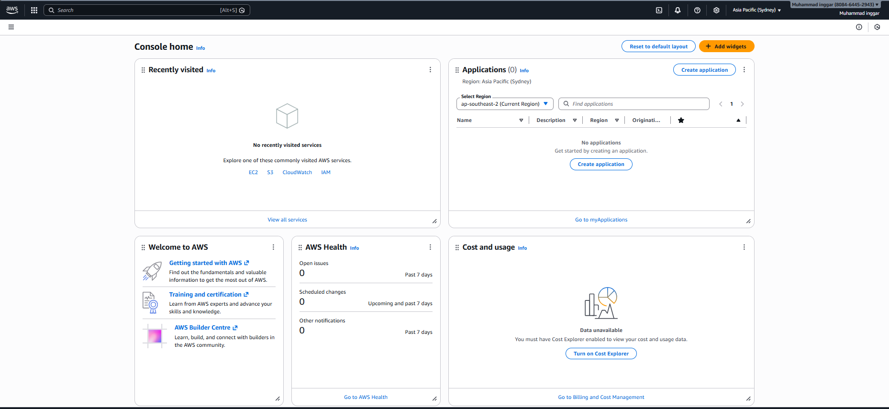
