# Membuat EC2 / Instance /VM

1. Pilih menu All Services  -> Ec2
   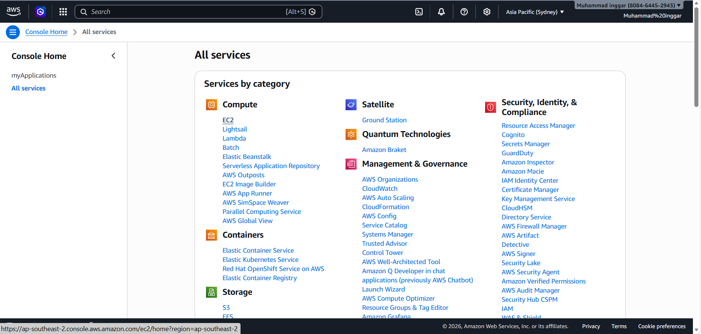

2. Di dalam menu EC2 pilih instances
   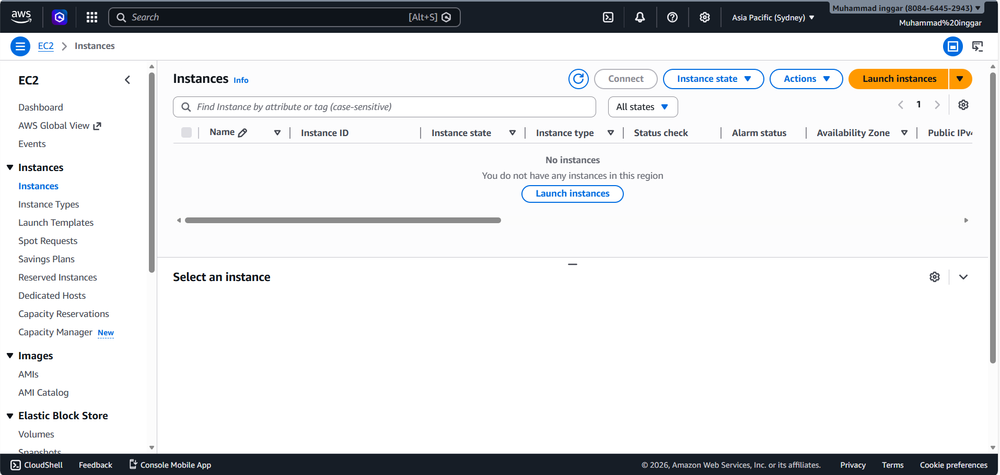

3. dalam instances Pilih menu Launch Intences
   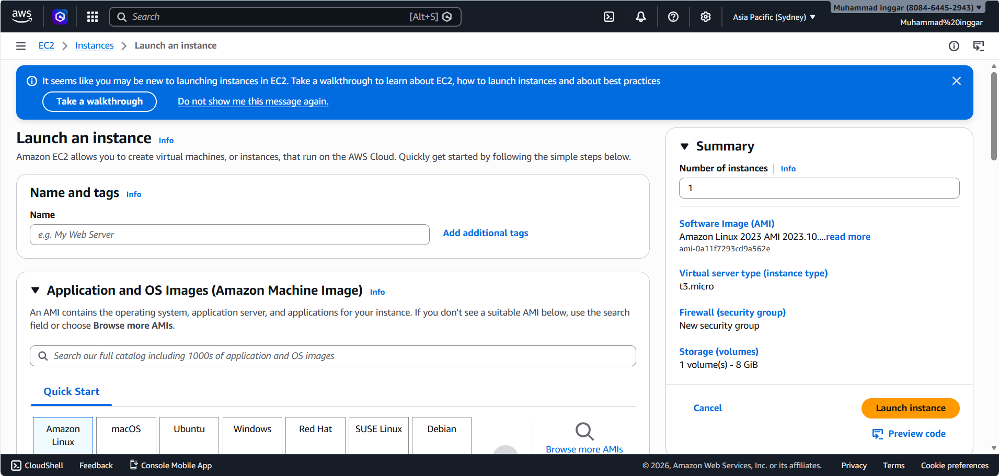

4. Beri nama Instance dengan format Nim_server
   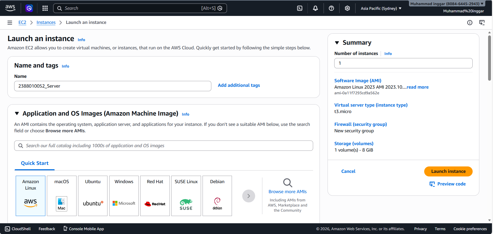

5. Pilih OS Server untuk Instances
   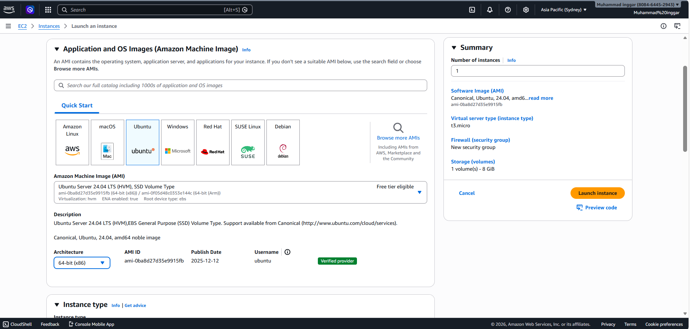

6. Pilih Resource Instaances T3.,icro (2VCPU, 1GB Memory)
   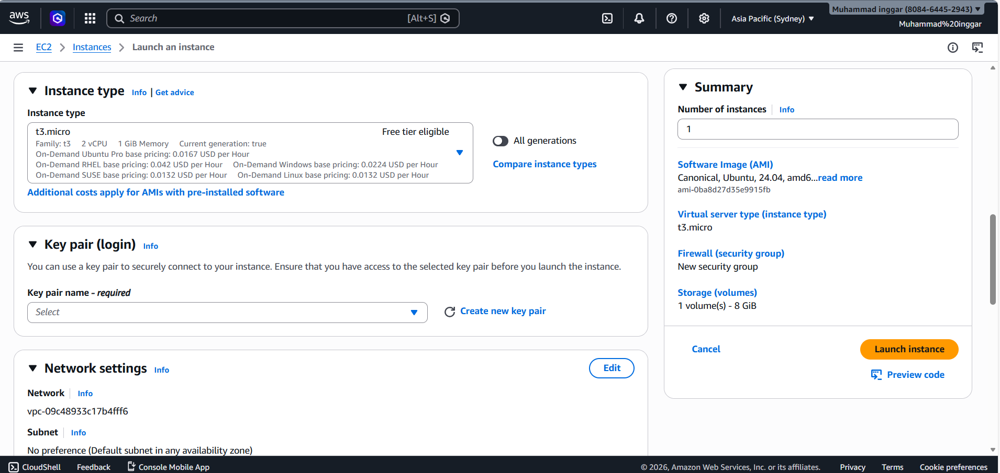

7. Membuat Key Pair, Pilih Menu create new key pair, Isi nama Key Pair, Pilih RSA, Format file .pem,   Klik Create New Key
   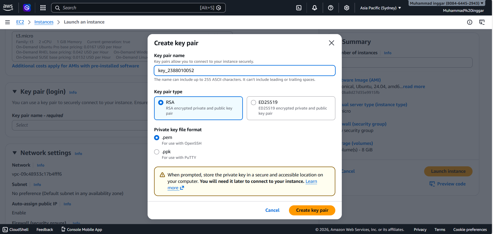

8. Setting kebijakan keamanan atau privasi / security group
    - Allow SSH   -> Artinya membolehkan Remote SSH dari luar
    - Allow HTTPS -> Artinya Instances bisa di akses dari protokol HTTPS
    -Allow HTTPS  -> Artinya Instances bisa di akses dari Protokol HTTP
   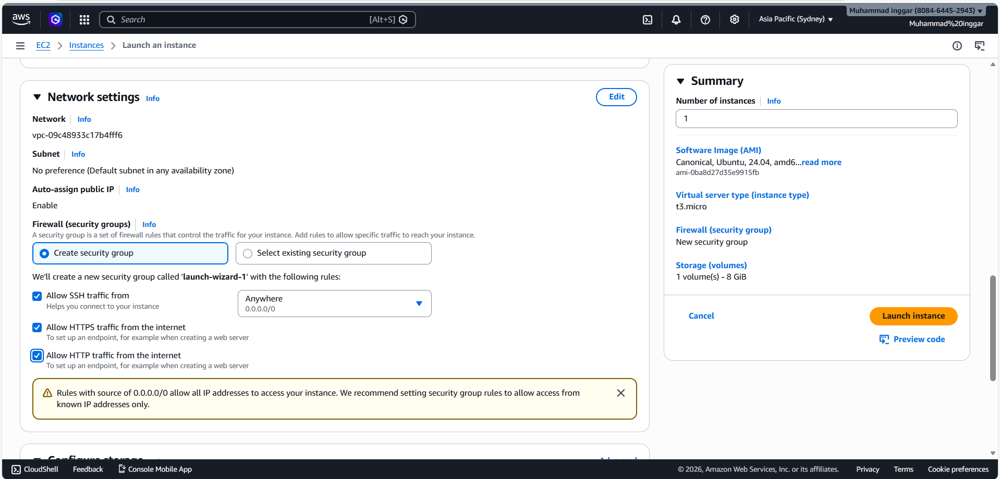

9. Selesai Setup pilih Launc Instances
   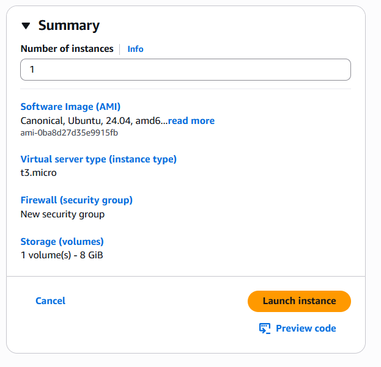
   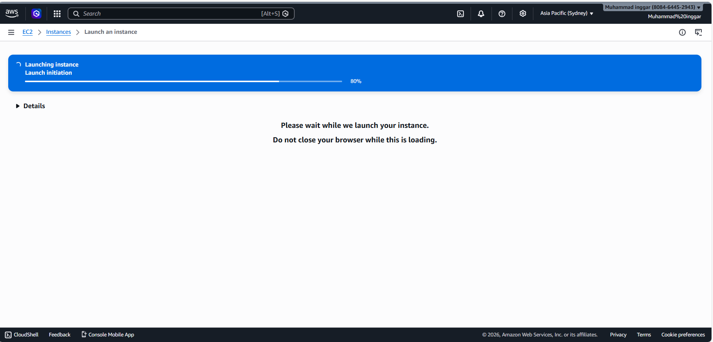

10. Pastikan Launch Instances Sukses
    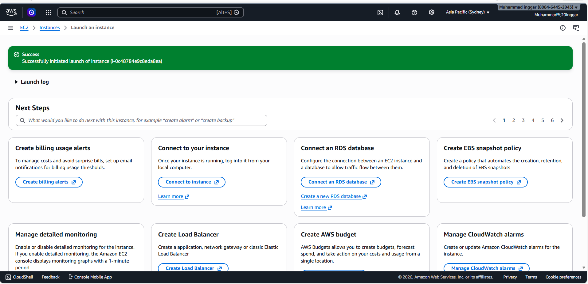

11. EC2 berhasil terbuat
    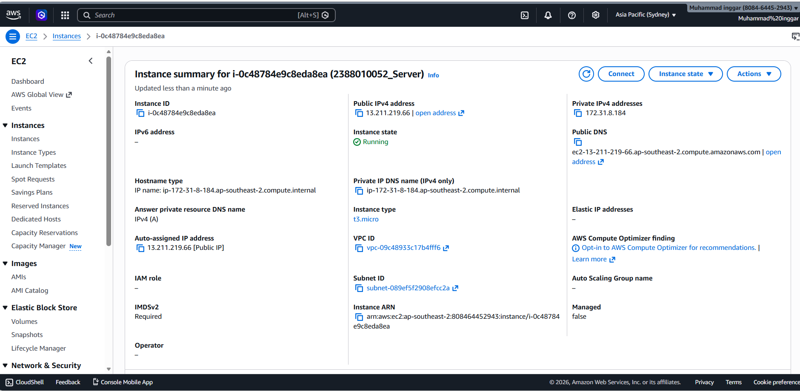
    

