# Remote Instances with SSH Putty

1. Install Putty dan pasang putty
   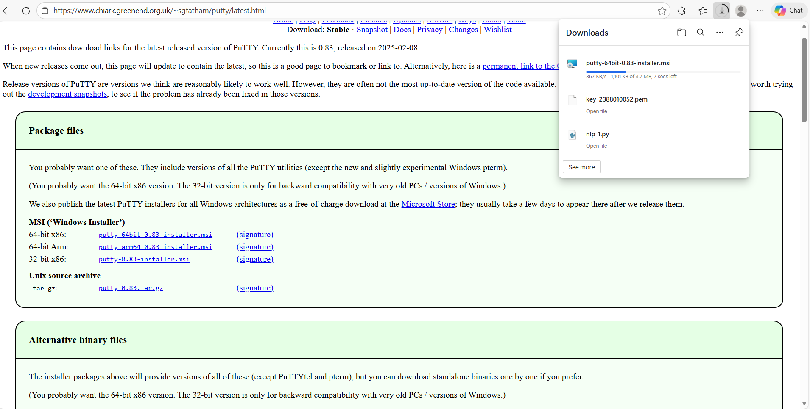
   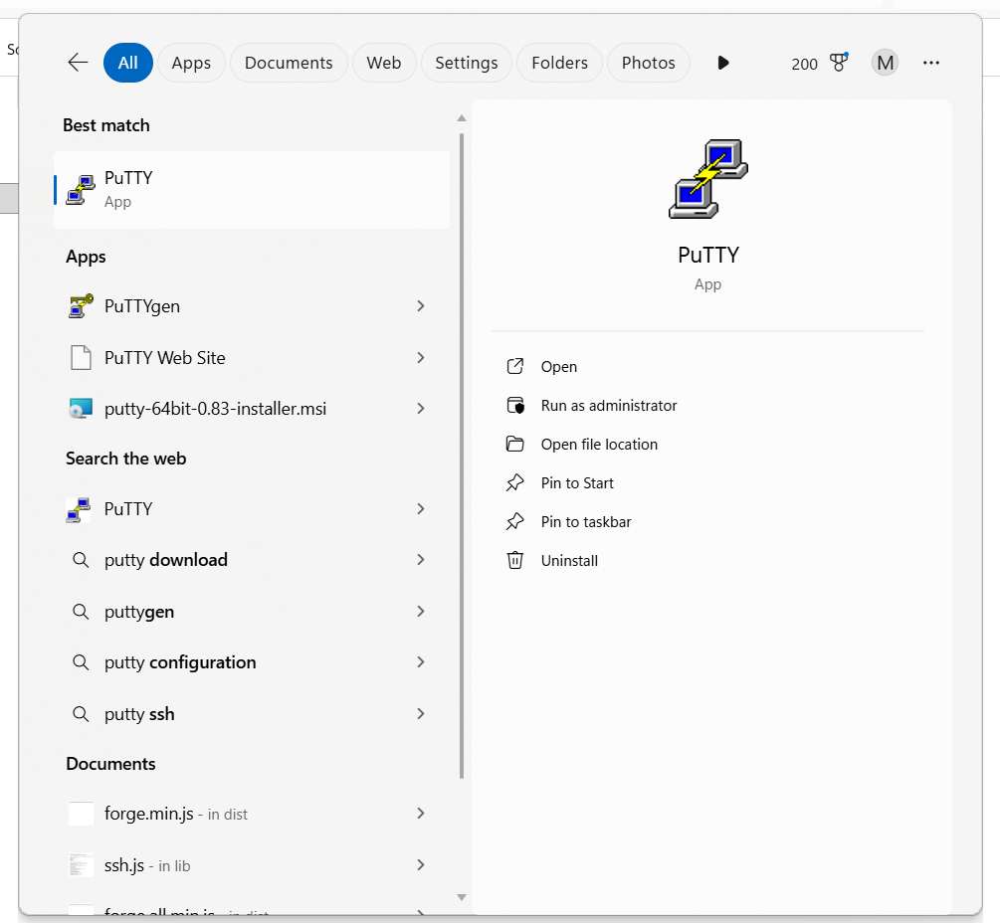

2. Konversi file public key dari .pem menjadi .ppk do Putty
   - buka puttyGen 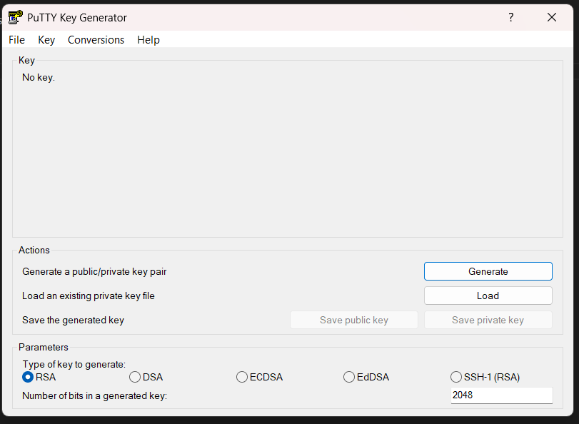
   - load data file key.pem 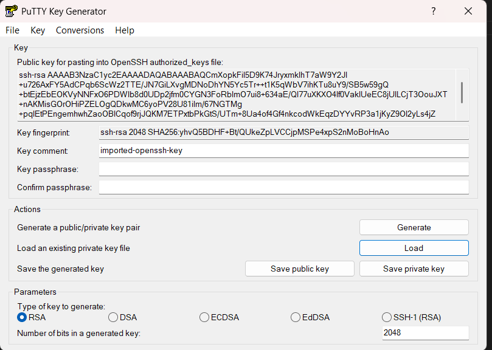
   - Save File File key .ppk 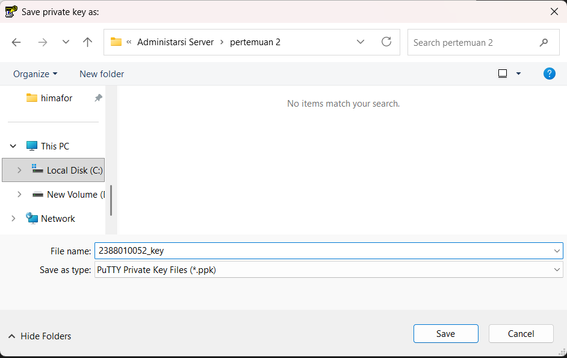

3. Set Up Putty untuk remote SSH
   - Buka apps Putty 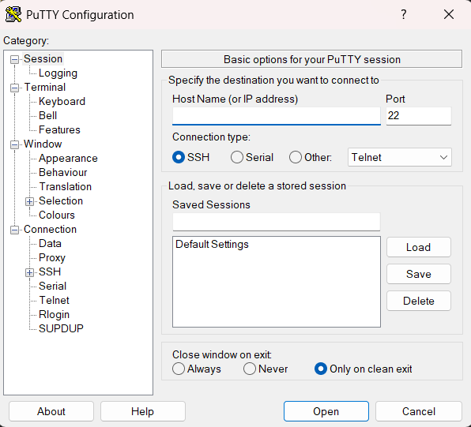
   - Isi IP public innstances 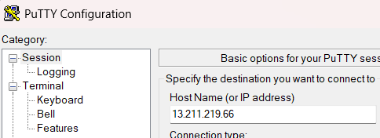
   - Isi port untuk SSH sesuai Security Group 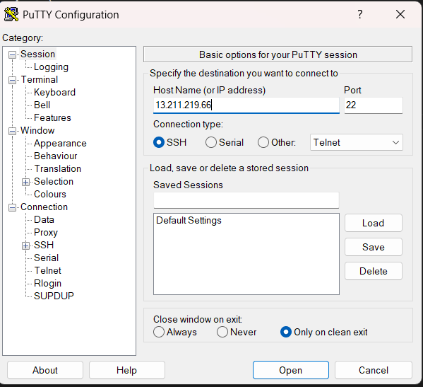
   - Isi nama session agar saat connect lagi tinggal load saya 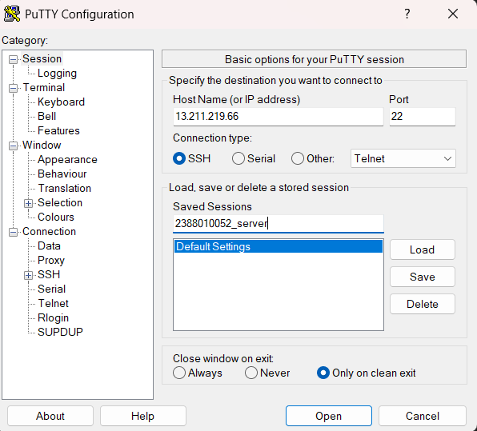
   - Load .ppk (Klik SSH -> Klik Auth -> Klik Gredential -> Load data ) 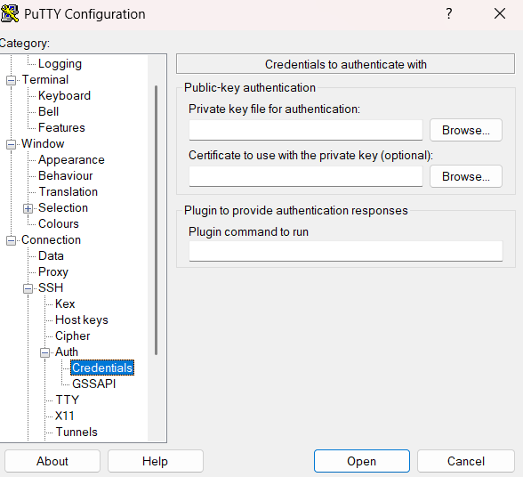
   - Kembali ke sessions Klik save 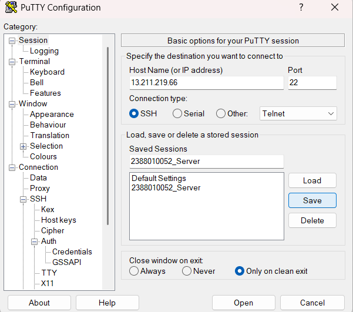
   - Klik Open dan masukan User name sesuai intences 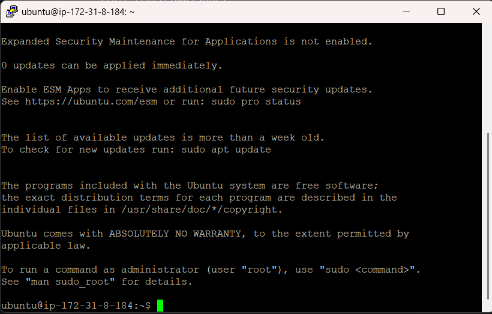
   
4. Update
   - sudo apt-get update 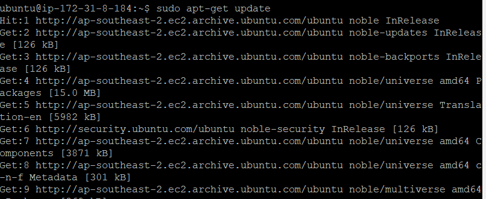
   - sudo apt-get upgrade 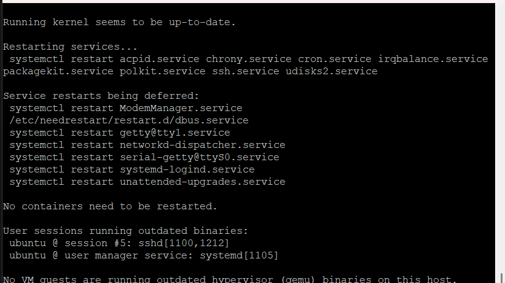

5. Pembuktian remote SSH secara visual
   - Copy Public ip adress instance paste ke browser 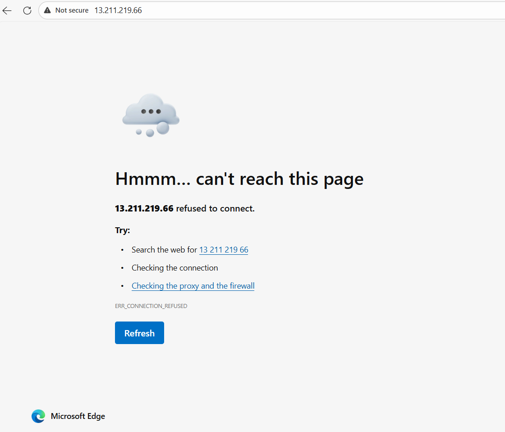
   - install web server seperti Apache/Nginx
   - sudo install apt install apache2
   - reload browser 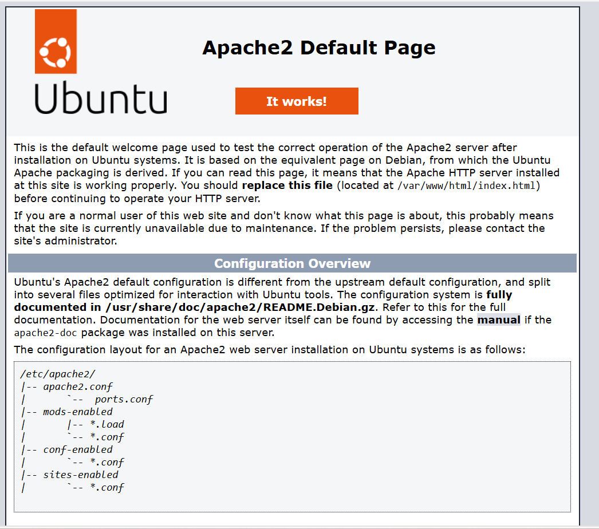

6. Matikan Instance agar tidak kena tagihan
   - sudo shutdown now 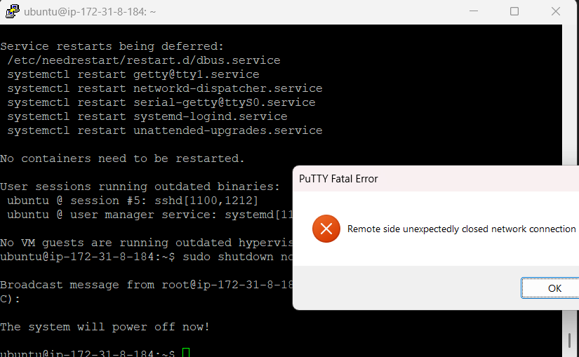 
   - cek di awas instance 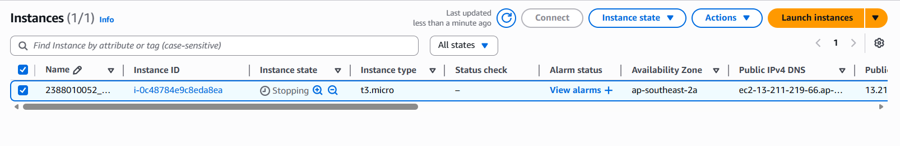

