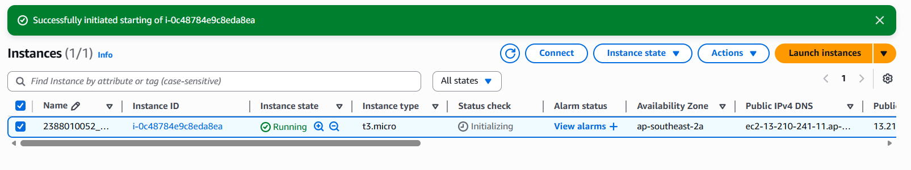
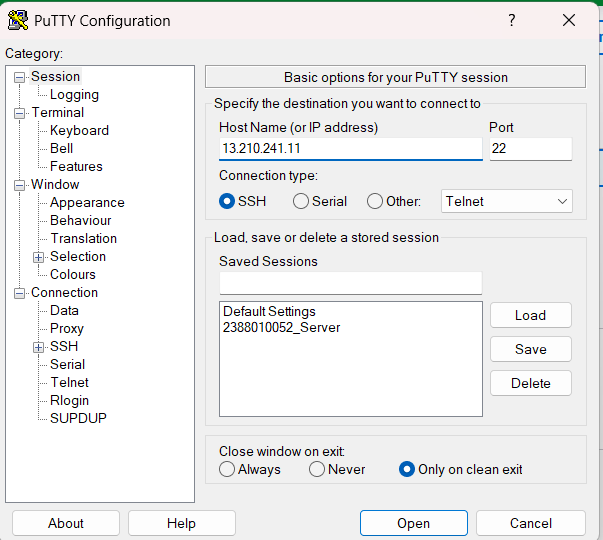
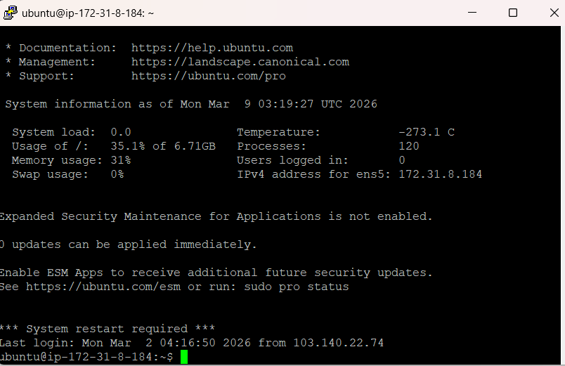
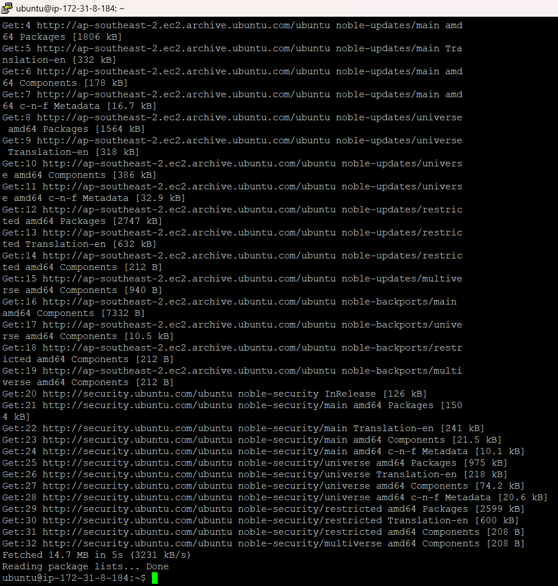
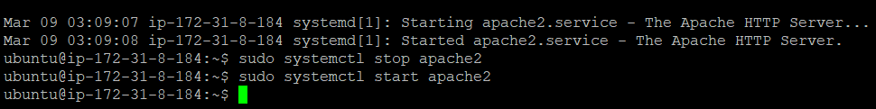
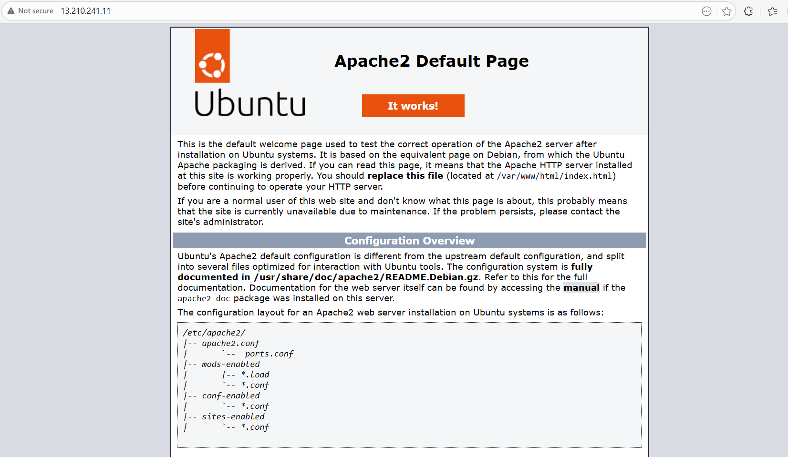
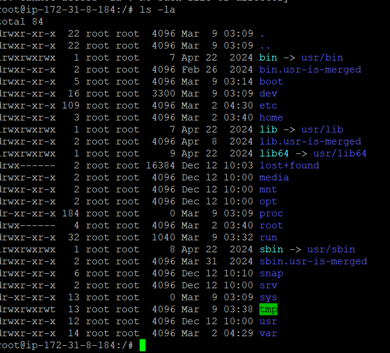
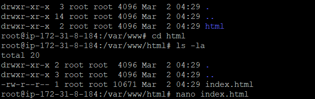
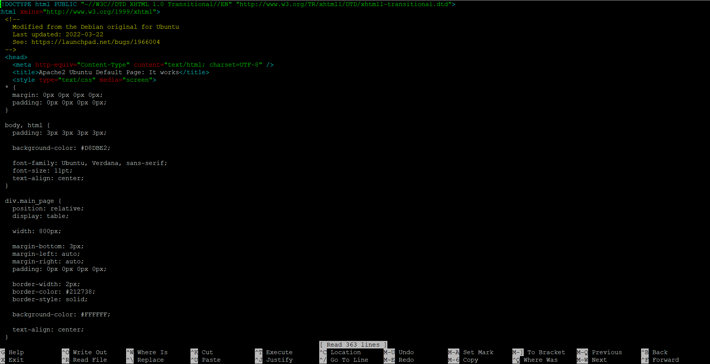
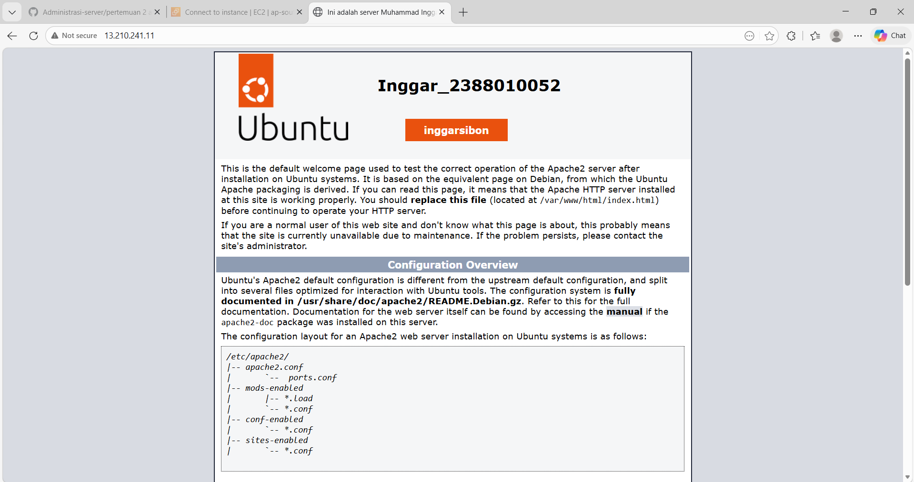

# Implementasi beberapa comand line interface linux

1. start instance 
2. buka puty
3. load session yang di simpan, update ip adress dan konfigurasi ulang 
4. Login ulang sebagai ubuntu
5. suco apt-get update (untuk paching os linux server) 
6. cek web server (systemctl status apache2) 
7. sudo systemctl stop apache2 (untuk menghentikan web server) 
8. sudo systemctl start apache2 (untuk start ulang) 
9. masukan command ls - la untuk melihat directory tempat cursor aktif
10. masukan sudo su (untuk masuk ke home)
11. masukan cd ../.. untuk ke root folder 
12. masuk foler var dengan klik (cd ../../..) cd var/www/html  
13. masukan nano index.html untuk cosmtum nama dan nim  
14. sudah berhasil di update 

