# Migrasi file local ke Cloud Server (AWS EC2)

1. Memilih tools Migrasi File, misal kita gunakan Filezilla
   - Unduh dan install Filezilla https://filezilla-project.org/download.php?type=client
   - Buka Filezilla 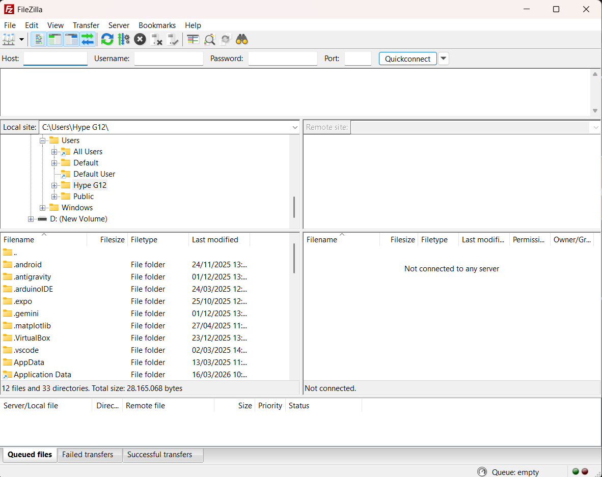
   - Aktifkan server local 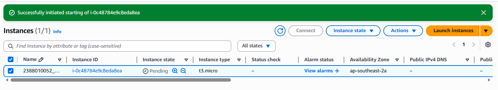
   - Kembali ke filezilla 
   - klik file 
   - klik site meneger 
   - klik new site 
   - berikan nama nim_server 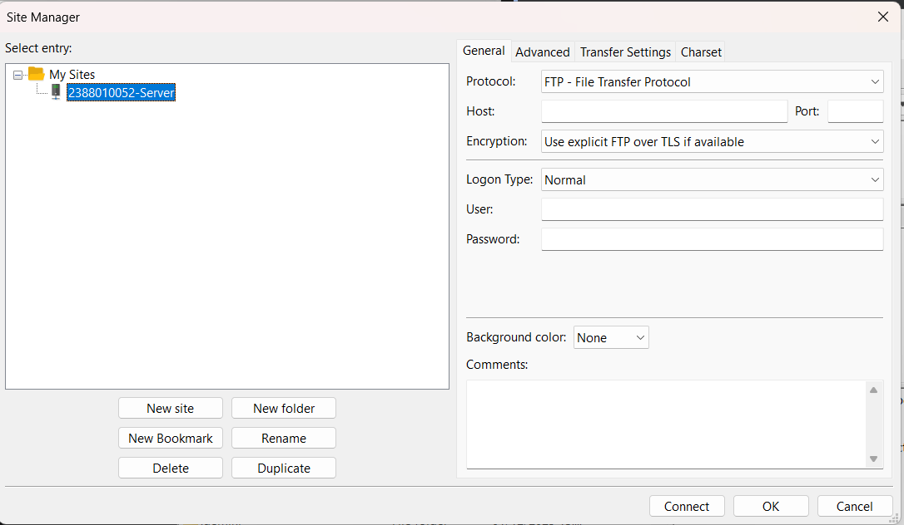 
   - Logon type > 

   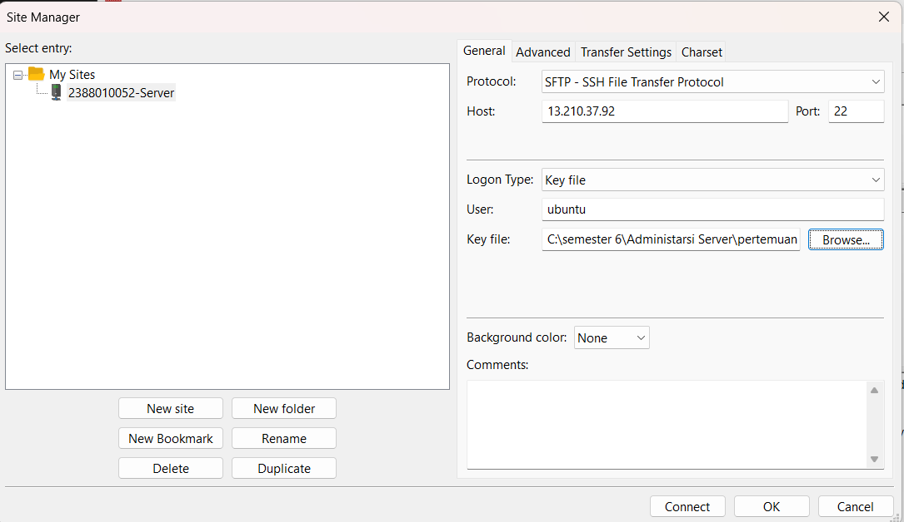

2. Pada dashboard utama filezilla
   - Panel kiri > File Local 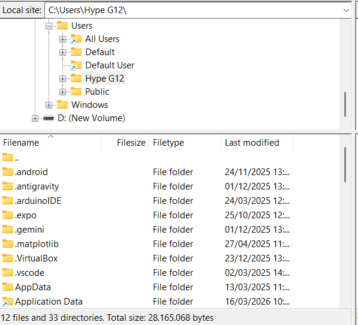
   - Panel Kanan > Pilih server (AWS EC2) 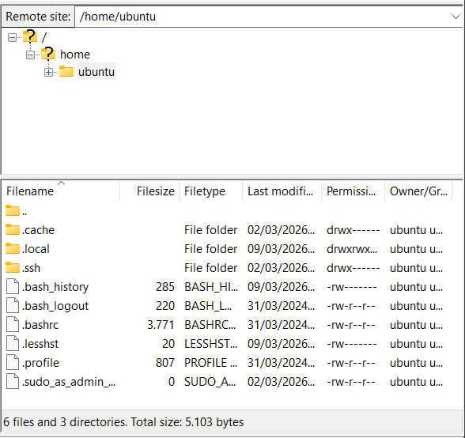
     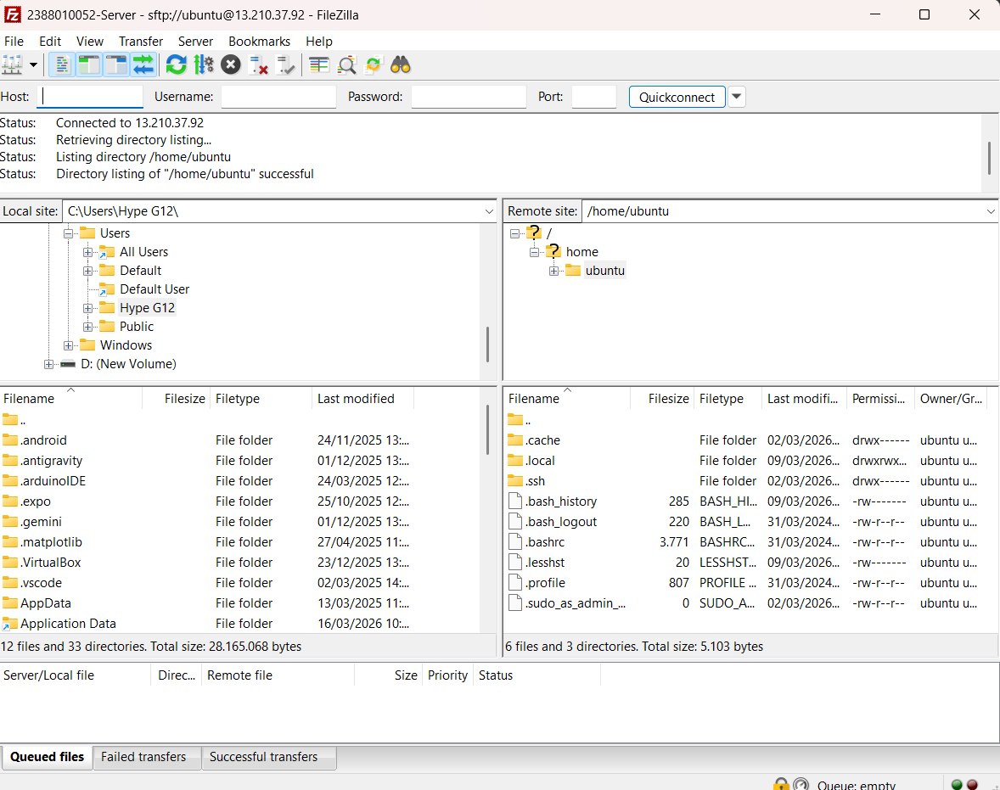

3. Arahkan directory cloud (Panel kanan) ke Folder web server services area 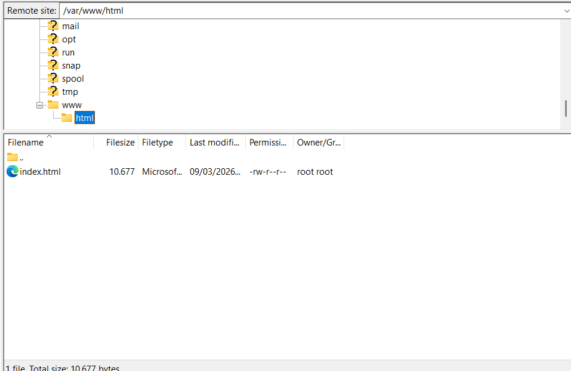

4. 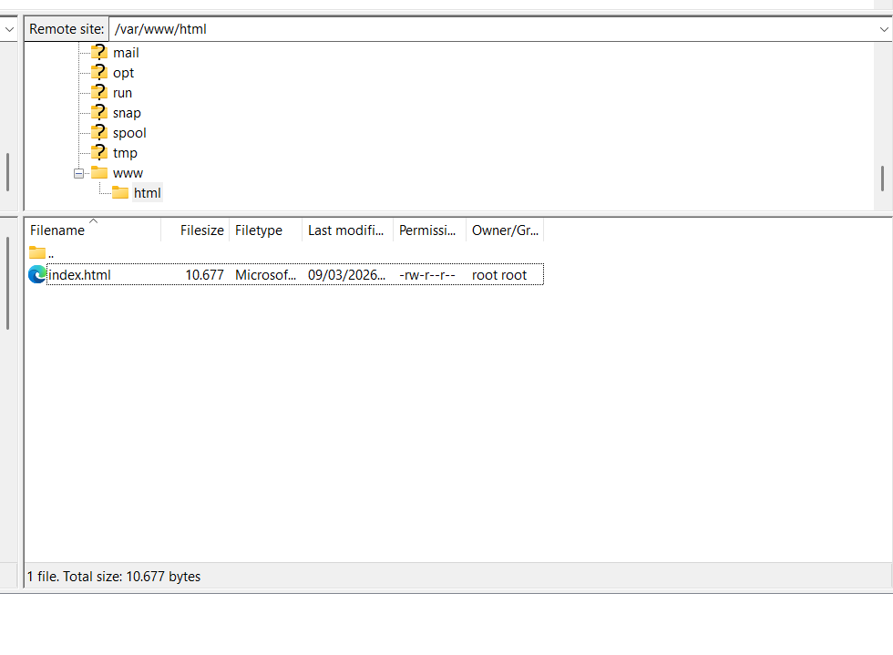

5. berhasil save web index.html 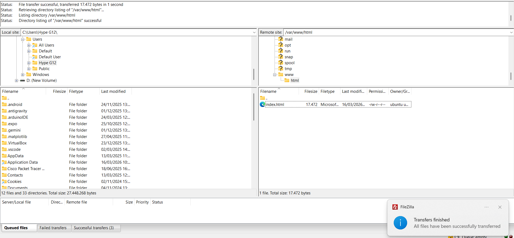

6. membuka web nya lagi 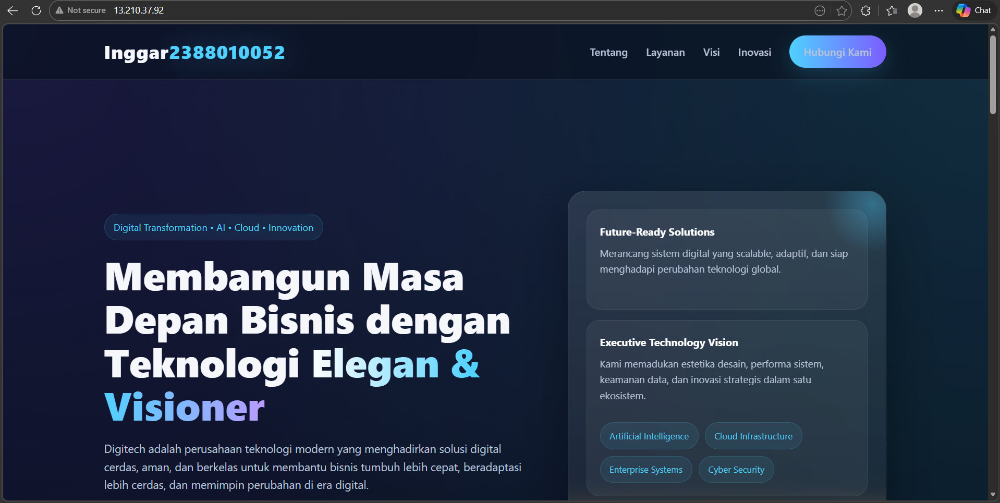

   

